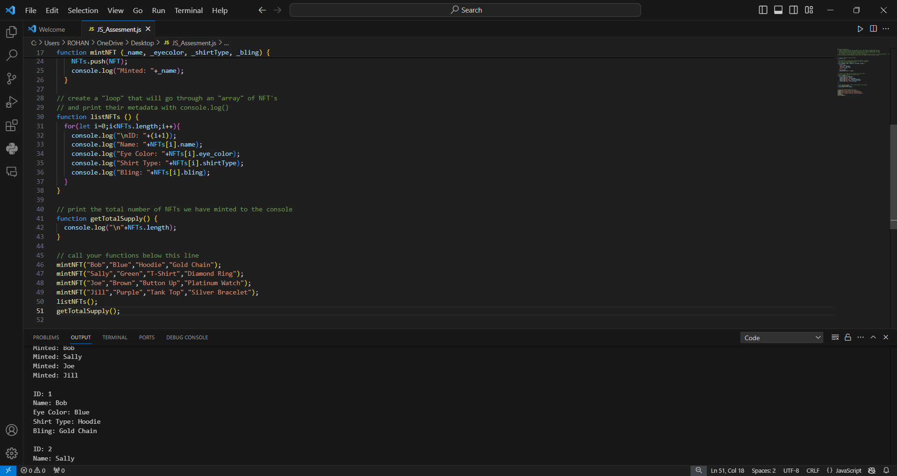

## NFT Creation and Metadata Display in JavaScript
-In this code walkthrough, I guide you through the creation of a variable to track the number of entities, illustrating the construction of an object within the primary NFT function. We delve into the various parameters and values used in the NFT function, showcasing how to output the metadata of the NFTs to the console effectively.

# Key Highlights:
-Variable Creation:
-Learn the process of creating a variable to effectively capture and manage the count of entities. This variable, named NFTs, acts as a repository for NFT information.

-Object Creation:
-Explore the steps involved in creating an object within the primary NFT function. This object encapsulates metadata such as the name, eye color, shirt type, and bling associated with each NFT.

-Parameter Explanation:
-Understand the significance of different parameters and values utilized in the NFT function. The parameters (_name, _eyecolor, _shirtType, _bling) allow flexible customization of NFT metadata during the minting process.

-Console Output:
-Witness the process of printing NFT metadata to the console. The mintNFT function not only creates NFTs but also provides a visual confirmation through log messages indicating the successful minting of each NFT.

-Total NFT Length:
-Gain insights into calculating the total length of the NFTs array using the getTotalSupply function. This function prints the total number of minted NFTs, providing an overview of the overall NFT collection.

-"List NFTs" Function:
-Learn how to effectively call the "listNFTs" function to iterate through the NFTs array and print detailed metadata for each NFT. This function enhances visibility into the specifics of each minted NFT, facilitating easy analysis and reference.

# SCREENSHOT

-This code not only demonstrates the mechanics of NFT creation but also emphasizes the importance of organized metadata tracking and effective console output for a comprehensive understanding of the NFT collection.
